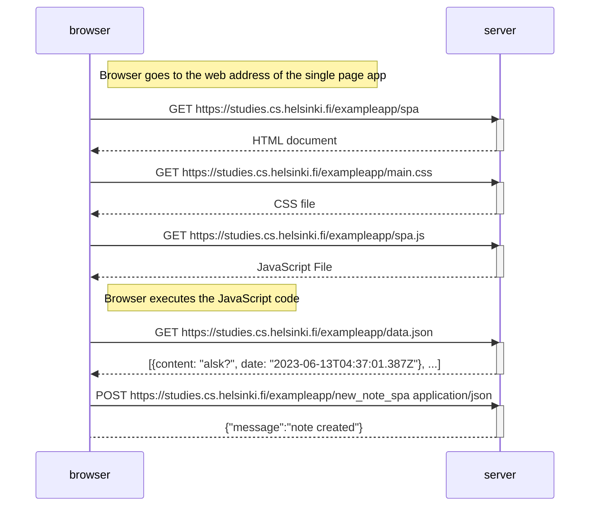

Task 0.6

```mermaid
sequenceDiagram
    participant browser
    participant server

    Note right of browser: Browser goes to the web address of the single page app

    browser->>server: GET https://studies.cs.helsinki.fi/exampleapp/spa
    activate server
    server-->>browser: HTML document
    deactivate server

    browser->>server: GET https://studies.cs.helsinki.fi/exampleapp/main.css
    activate server
    server-->>browser: CSS file
    deactivate server

    browser->>server: GET https://studies.cs.helsinki.fi/exampleapp/spa.js
    activate server
    server-->>browser: JavaScript File
    deactivate server

    Note right of browser: Browser executes the JavaScript code

    browser->>server: GET https://studies.cs.helsinki.fi/exampleapp/data.json
    activate server
    server-->>browser: [{content: "alsk?", date: "2023-06-13T04:37:01.387Z"}, ...]
    deactivate server

    browser->>server: POST https://studies.cs.helsinki.fi/exampleapp/new_note_spa application/json
    activate server
    server-->browser: {"message":"note created"}
    deactivate server


```
